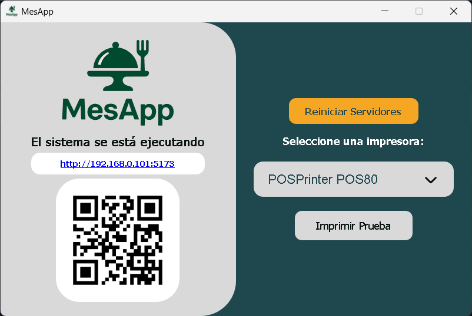

# 🖥️ Order Reception System - Print Client (PyQt5)

This project is a desktop application developed in **Python** using the **PyQt5** library for the graphical user interface. Its main purpose is to act as a print client in a restaurant order management system, communicating with a web application (hosted in a separate repository).

## 🚀 Features

- 🖨️ **Automatic printing of orders** received from the web application via **WebSockets**.
- 🔌 **Execution of local servers** required for system communication.
- 📎 **Printer selection** (80mm thermal printer) from the user interface.
- 🔄 **Manual server restart** with a single click.
- 📱 **Automatic QR code generation** to facilitate access to the web app from other devices.

## 🌐 Web Application

> This client is designed to work in conjunction with a web-based order-taking application, which is hosted in a **separate repository**.

## 🛠️ Technologies Used

- **Python 3**
- **PyQt5**
- **WebSockets**
- **QZ Tray / Direct printing**
- **Local server (Flask, FastAPI, or similar depending on the implementation)**

## 📸 Interface and Quick Access

